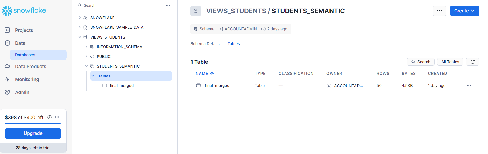
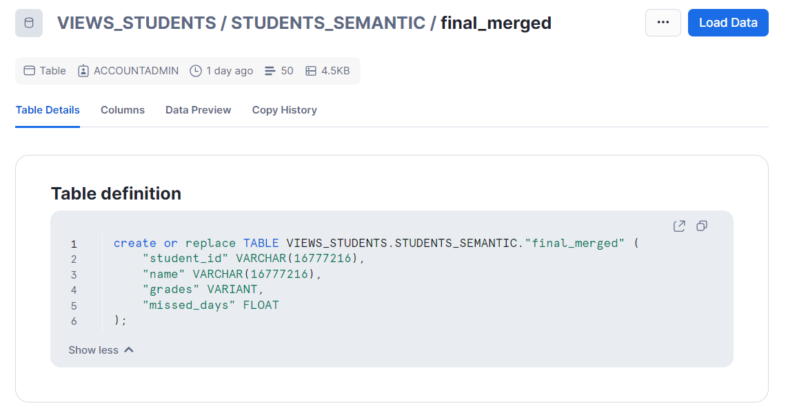
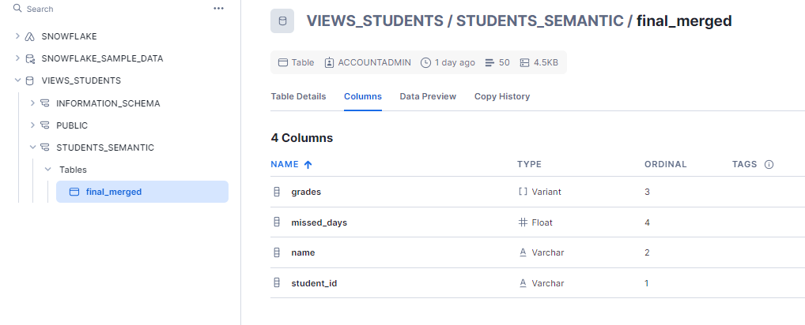
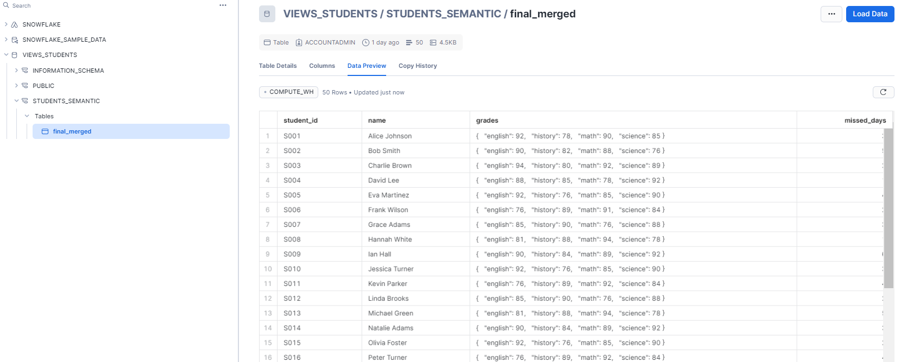
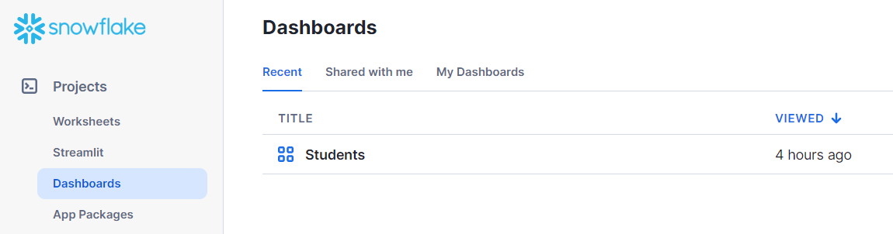
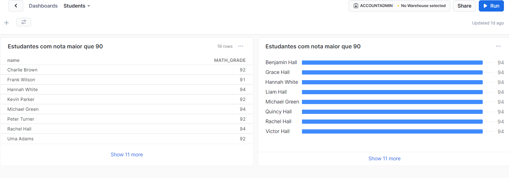

# Final Coding Evaluation

## Goal:
> Create an Airflow pipeline to migrate student data into Snowflake.

* For that were used two JSON files:

    - students.json

    - missed_days.json

> For process orchestration were developed the following funcions in dag structure:
[Code dag Airflow ]([https://pages.github.com/](https://github.com/thaiscvaz/case_hcl_docker_airflow/blob/main/airflow-docker/dags/student_data_migration.py))

- **validate_students**: load the json containing the student data:

  | student_id| name | grades_math | grades_science | grades_history | grades_english |

-  **validate_missed_days**: load the json containing the missed data. 

    | student_id | missed_days |

- **join_datasets**: merge data from both generated dataframes using 'student_id' as key. join datasets using DataFrame

- **load_data_to_snowflake**: generate a CSV from previous merged dataframe.

- **migrate_student_data_to_snowflake**: upload informations to Snowflake.

### Snowflake

> In **Snowflake**, the file was loaded in the VIEWS_STUDENTS Database in table FINAL_MERGED.

> The table FINAL_MERGED was created in STUDENTS_SEMANTIC filtering Math grade greater than 90:

## Dashboard

> In **Snowflake**, create 2 views for exemple:

